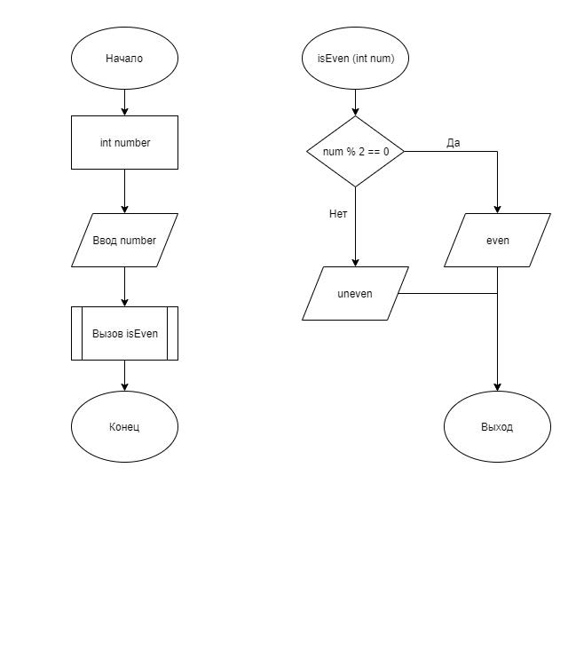

# Задание 1_1_1

## 1 ПОСТАНОВКА ЗАДАЧИ

Программа демонстрирует работу условного оператора. Написать программу, которая проверяет, является или нет число четным.

### Входные данные
 Целочисленное значение в десятеричном формате

### Выходные данные
Если введенное число четное, то с первой позиции вывести слово «even», иначе вывести «uneven»

## 2 МЕТОД РЕШЕНИЯ
Для решения задачи используется
- функция isEven для проверки чётности переданного числа;
- функция main для определения входной точки программы;
- библиотека ввода-вывода;

## 3 ОПИСАНИЕ АЛГОРИТМОВ

### Функция isEven
- Функционал: Проверяет чётно ли число. Если да, то выводит even, в
 противном случае uneven.
- Параметры: int number
- Возвращаемое значение: void

| № | Предикат | Действия | № перехода |
| - | -------- | -------- | ---------- |
| 1 | Остаток от деления на 2 = 0 | Вывод even | 0 |
|   | | Вывод uneven | 0 |

### Функция main
- Функционал: Входная точка программы.
- Параметры: нет.
- Возвращаемое значение: int.

| № | Предикат | Действия | № перехода |
| - | -------- | -------- | ---------- |
| 1 | | Объявление number | 2 |
| 2 | | Ввод number | 3 |
| 3 | | Вызов isEven(number) | 0 |

## 4 БЛОК-СХЕМА



## 5 ИСХОДНЫЙ КОД

### main.cpp
```cpp
#include <iostream>

void isEven(int num)
{
    if (num % 2 == 0)
    {
        std::cout << "even";
    }
    else
    {
        std::cout << "uneven";
    }
}

int main()
{
    int number;
    std::cin >> number;
    isEven(number);
    return 0;
}
```

## 6 ТЕСТИРОВАНИЕ
| Входные данные | Ожидаемые выходные данные | Фактические выходные данные |
| -------- | -------- | ---------- |
| 2 | even | even |
| 3 | uneven | uneven |