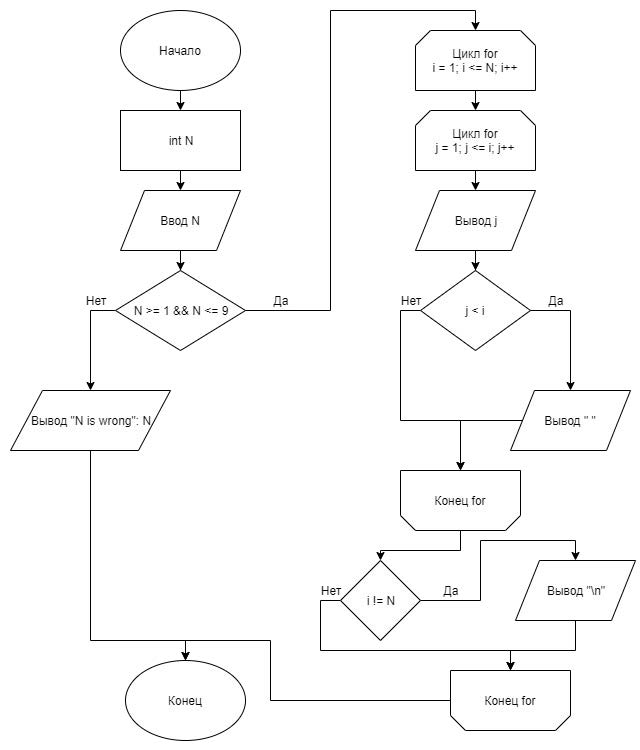

# Задание 1_1_5

## 1 ПОСТАНОВКА ЗАДАЧИ

Вывести пирамиду из чисел от 1 до N. Допустимая высота от 1 до 9
включительно. Использовать циклы.

### Входные данные
Целое число N.

### Выходные данные
Пирамида из натуральных чисел высоты N. Первое число в строке
выводиться с первой позиции. Остальные разделены одним пробелом. Если N
введено неверно, вывести:

N is wrong: «значение N»

#### Пример:
1<br>
1 2<br>
1 2 3<br>
1 2 3 4<br>
1 2 3 4 5

## 2 МЕТОД РЕШЕНИЯ
Для решения задачи используется:
- функция main для определения входной точки программы;
- стандартная библиотека ввода-вывода;
- оператор цикла;
- оператор ветвления.

## 3 ОПИСАНИЕ АЛГОРИТМОВ

## Функция main
- Функционал: Входная точка программы.
- Параметры: нет.
- Возвращаемое значение: int.

| № | Предикат | Действия | № перехода |
| - | -------- | -------- | ---------- |
| 1 | | Объявление int N | 2
| 2 | | Ввод int N | 3 |
| 3 | N >= 1 и N <= 9 | | 4 |
| | | Вывод: "N is wrong: N" | 0 |
| 4 | | Объявление i = 0 | 5 |
| 5 | i <= N | | 6 |
| | | | 0 |
| 6 | | Объявление j = 0 | 7 |
| 7 | j <= i | Вывод j | 8 |
| | | | 8 |
| 8 | j < i | Вывод " " | 9 |
| | | | 9 |
| 9 | | j++ | 10 |
| 10 | i != N | Вывод "\n" | 11 |
| | | | 11 |
| 11 | | i++ | 6 |

## 4 БЛОК-СХЕМА



## 5 КОД ПРОГРАММЫ
### main.cpp

```cpp
#include <iostream>

int main()
{
    int N;
    std::cin >> N;
    if (N >= 1 && N <= 9)
    {
        for (int i = 1; i <= N; i++)
        {
            for (int j = 1; j <= i; j++)
            {
                std::cout << j;
                if (j < i)
                {
                    std::cout << " ";
                }
            }
            if (i != N)
            {
                std::cout << std::endl;
            }
        }
    }
    else
    {
        std::cout << "N is wrong: " << N << std::endl;
    }
}
```

## 6 ТЕСТИРОВАНИЕ
| Входные данные | Ожидаемые выходные данные | Фактические выходные данные |
| -------- | -------- | ---------- |
| 1 | 1 | 1 |
| 2 | 1<br>1 2 | 1<br>1 2 |
| 10 | N is wrong: 10 | N is wrong: 10 |
| 4 | 1<br>1 2<br>1 2 3<br>1 2 3 4 | 1<br>1 2<br>1 2 3<br>1 2 3 4 |