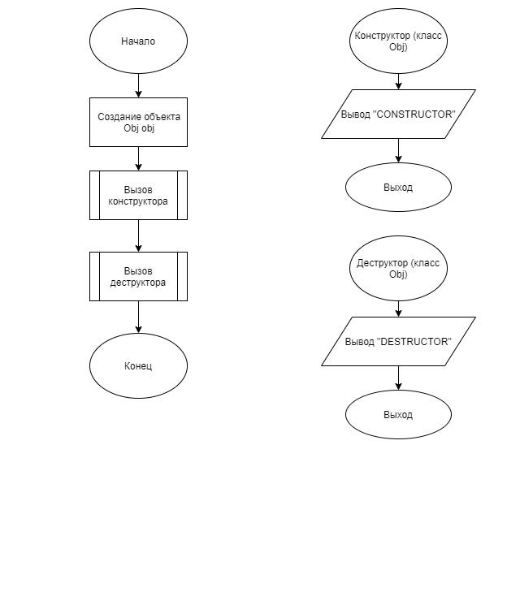

# Задание 1_2_1 - Жизненный цикл объекта

## 1 ПОСТАНОВКА ЗАДАЧИ

Сконструировать систему из одного объекта, которая демонстрирует
последовательность выполнения этапов ЖЦ объекта и действие компилятора по
части добавления фрагмента кода.
Система состоит из одного объекта. У объекта нет свойств. Объект на этапе
ЖЦ «создание» сообщает об отработке метода конструктора. На этапе ЖЦ
«демонтаж» сообщает об отработке метода деструктора.
Алгоритм отработки системы.
1. Построение системы: объявить объект.
2. Завершить работу систему.

### Входные данные
Отсутствуют.

### Выходные данные
Первая строка, с первой позиции:<br>
`CONSTRUCTOR`<br>
Вторая строка, с первой позиции:<br>
`DESTRUCTOR`

## 2 МЕТОД РЕШЕНИЯ

Для решения задачи используется:
- объект obj класса MyObj предназначен для отработки конструктора и
деструктора;
- функция main для определения входной точки программы;
- стандартная библиотека ввода-вывода;
- заголовочный файл;
- класс.

Класс MyObj:
- Собственные свойства и методы отсутствуют.

## 3 ОПИСАНИЕ АЛГОРИТМОВ

### Конструктор класса MyObj
- Функционал: Вывод "CONSTRUCTOR".
- Параметры: нет.

| № | Предикат | Действия | № перехода |
| - | -------- | -------- | ---------- |
| 1 | | Вывод "CONSTRUCTOR" | 0 |

### Деструктор класса MyObj
- Функционал: Вывод "DESTRUCTOR".
- Параметры: нет.

| № | Предикат | Действия | № перехода |
| - | -------- | -------- | ---------- |
| 1 | | Вывод "DESTRUCTOR" | 0 |

### Функция main
- Функционал: Входная точка программы.
- Параметры: нет.
- Возвращаемое значение: int.

| № | Предикат | Действия | № перехода |
| - | -------- | -------- | ---------- |
| 1 | | Создание объекта obj класса MyObj с помощью конструктора | 2 |
| 2 | | Удаление объекта obj класса MyObj с помощью деструктора | 0 |

## 4 БЛОК-СХЕМА

###### Примечание: Obj заменить на MyObj


## 5 ИСХОДНЫЙ КОД

### main.cpp
```cpp
#include "MyObj.h"

int main()
{
    MyObj obj;
    return 0;
}
```

### MyObj.cpp
```cpp
#include "MyObj.h"

MyObj::MyObj()
{
    std::cout << "CONSTRUCTOR" << std::endl;
}
MyObj::~MyObj()
{
    std::cout << "DESTRUCTOR" << std::endl;
}
```

### MyObj.h
```cpp
#ifndef __MYOBJ__H
#define __MYOBJ__H

#include <iostream>

class MyObj {
public:
    MyObj();
    ~MyObj();
};

#endif
```

## 6 ТЕСТИРОВАНИЕ
| Входные данные | Ожидаемые выходные данные | Фактические выходные данные |
| -------- | -------- | ---------- |
|  | CONSTRUCTOR<br>DESTRUCTOR | CONSTRUCTOR<br>DESTRUCTOR |