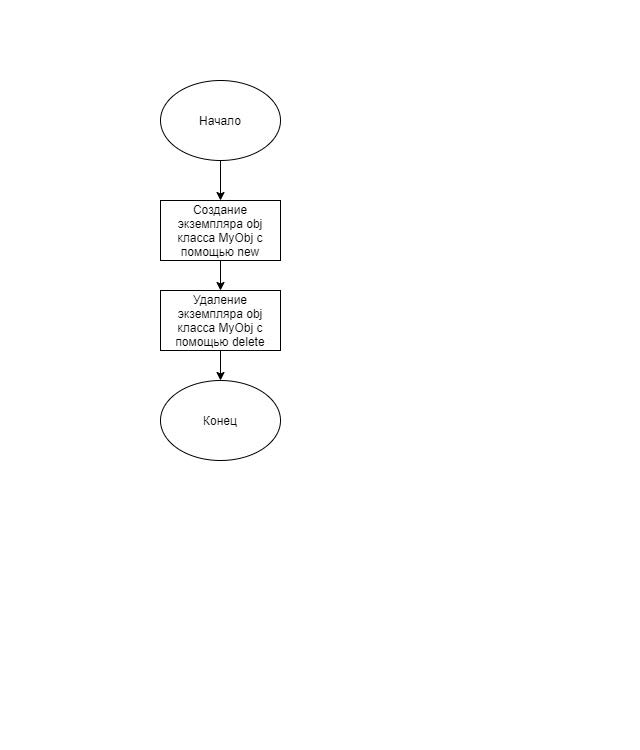

# Задание 1_3_1 - Жизненный цикл объекта

## 1 ПОСТАНОВКА ЗАДАЧИ

Сконструировать систему, которая демонстрирует последовательность
 выполнения этапов ЖЦ объекта, возможность динамического изменения состава
 элементов системы.
 Для построения системы использовать один объект. У объекта нет свойств.
 Объект на этапе ЖЦ «создание» сообщает об отработке метода конструктора. На
 этапе ЖЦ «демонтаж» сообщает об отработке метода деструктора.
 Алгоритм отработки системы.
 1. Построение системы: создать объект.
 2. Уничтожить объект.
 3. Завершить работу систему.

### Входные данные
Отсутствуют.

### Выходные данные
Первая строка, с первой позиции:<br>
`CONSTRUCTOR`<br>
Вторая строка, с первой позиции:<br>
`DESTRUCTOR`

## 2 МЕТОД РЕШЕНИЯ

Для решения задачи используется:
- указатель

## 3 ОПИСАНИЕ АЛГОРИТМОВ|

### Функция main
- Функционал: Входная точка программы.
- Параметры: нет.
- Возвращаемое значение: int.

| № | Предикат | Действия | № перехода |
| - | -------- | -------- | ---------- |
| 1 | | Создание объекта obj класса MyObj с помощью new | 2 |
| 2 | |  Удаление объекта obj с помощью delete | 0 |

## 4 БЛОК-СХЕМА



## 5 ИСХОДНЫЙ КОД

### main.cpp
```cpp
#include "MyObj.h"

int main()
{
    MyObj* obj = new MyObj;
    delete obj;
    return 0;
}
```

### MyObj.cpp
```cpp
#include "MyObj.h"

MyObj::MyObj()
{
    std::cout << "CONSTRUCTOR" << std::endl;
}
MyObj::~MyObj()
{
    std::cout << "DESTRUCTOR" << std::endl;
}
```

### MyObj.h
```cpp
#ifndef __MYOBJ__H
#define __MYOBJ__H

#include <iostream>

class MyObj {
public:
    MyObj();
    ~MyObj();
};

#endif
```

## 6 ТЕСТИРОВАНИЕ
| Входные данные | Ожидаемые выходные данные | Фактические выходные данные |
| -------- | -------- | ---------- |
|  | CONSTRUCTOR<br>DESTRUCTOR | CONSTRUCTOR<br>DESTRUCTOR |