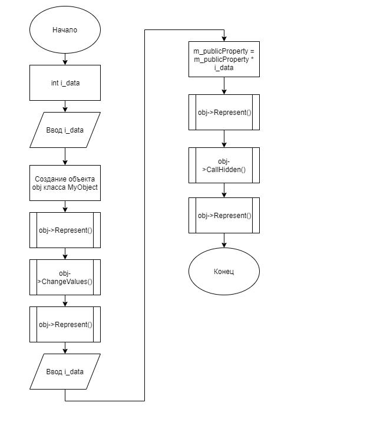
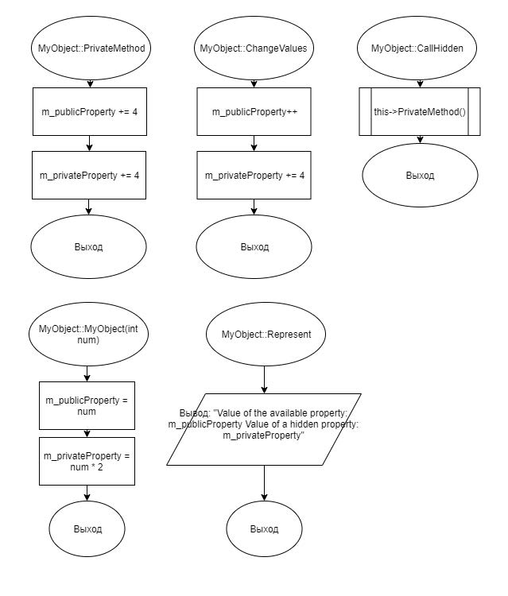

# Задание 2_1_1 - Доступ к элементам объекта

## 1 ПОСТАНОВКА ЗАДАЧИ

Сконструировать систему, которая демонстрирует возможность определения
режима доступа к элементам объекта.
Спроектировать объект, в котором есть доступные и скрытые элементы
(свойства и методы). Есть одно доступное свойство целого типа и одно скрытое
свойство целого типа.
У объекта есть доступные методы со следующим функционалом:
- метод с параметром целого типа, для определения исходного значения
элементов объекта. В методе доступному свойству присваивается значение
параметра, а скрытому свойству удвоенное значение параметра;
- Метод изменения значения доступного и скрытого свойства. Доступному
свойству добавляется 1, скрытому свойству добавляется 4;
- Метод вызова скрытого метода;
- Метод вывода состояния, выводит значение доступного и скрытого
свойства.
У объекта есть один скрытый метод со следующим функционалом:
- метод доступному свойству добавляет 4, скрытому свойству добавляет 8.
Написать программу, которая состоит из описания класса выше
представленного объекта и основной функции, в которой реализован следующий
алгоритм:
1. Ввод целочисленного значения переменной i_data.
2. Объявление объекта,
3. Вызов метода для определения исходного значения элементов объекта, в
качестве аргумента передается переменная i_data.
4. Вывод исходного состояния объекта.
5. Вызов метода изменения значений свойств объекта.
6. Вывод текущего состояния объекта.
7. Ввод целочисленного значения переменной i_data.
8. Непосредственное изменение доступного свойства объекта посредством
умножения его значения на i_data.
9. Вывод текущего состояния объекта.
10. Вызов метода объекта, который вызывает скрытый метод объекта.
11. Вывод текущего состояния объекта.

### Входные данные
Первая строка<br>
`«Целочисленное значение»`<br>
Вторая строка<br>
`«Целочисленное значение»`

### Выходные данные
Метод вывода состояния, первый вывод делает в первой строке, а далее
всегда с новой строки. Шаблон вывода:<br>
`Value of the available property «значение доступного свойства»; Value of a
hidden property «значение закрытого свойства»`

## 2 МЕТОД РЕШЕНИЯ

Для решения задачи используется:
- объект obj класса MyObject предназначен для работы с его методами;
- функция main для определения входной точки программы;
- стандартная библиотека ввода-вывода;
- класс;
- заголовочный файл;
- указатели.

Класс MyObject:
- свойства/поля:
    - поле приватное поле:
        - наименование — m_privateProperty;
        - тип — int;
        - модификатор доступа — private;
    - поле публичное поле:
        - наименование — m_publicProperty;
        - тип — int;
        - модификатор доступа — public;
- функционал:
    - метод PrivateMethod — увеличивает значение публичного поля на 4
и на 8 приватного;
    - метод ChangeValues — увеличивает значение публичного поля на 1
и на 4 приватного;
    - метод CallHidden — вызывает скрытый метод;
    - метод Represent — показывает текущее состояние полей.

## 3 ОПИСАНИЕ АЛГОРИТМОВ

### Конструктор класса MyObject
- Функционал: Инициализирует приватное и публичное поля.
- Параметры: int num.

| № | Предикат | Действия | № перехода |
| - | -------- | -------- | ---------- |
| 1 | | Инициализация поля m_privateProperty = num | 2 |
| 2 | | Инициализация поля m_publicProperty = num * 2 | 0 |

### Метод PrivateMethod класса MyObject
- Функционал: Увеличивает значение публичного поля на 4 и на 8
приватного.
- Параметры: нет.
- Возвращаемое значение: void.

| № | Предикат | Действия | № перехода |
| - | -------- | -------- | ---------- |
| 1 | | Увеличение значения m_publicProperty на 4 | 2 |
| 2 | | Увеличение значения m_publicProperty на 8 | 0 |

### Метод ChangeValues класса MyObject
- Функционал: Увеличивает значение публичного поля на 1 и на 4
приватного.
- Параметры: нет.
- Возвращаемое значение: void.

| № | Предикат | Действия | № перехода |
| - | -------- | -------- | ---------- |
| 1 | | Увеличивает значение m_publicProperty на 1 | 2 |
| 2 | | Увеличивает значение m_privateProperty на 4 | 0 |

### Метод CallHidden класса MyObject
- Функционал: Вызывает скрытый метод.
- Параметры: нет.
- Возвращаемое значение: void.

| № | Предикат | Действия | № перехода |
| - | -------- | -------- | ---------- |
| 1 | | Вызов PrivateMethod | 0 |

### Метод Represent класса MyObject
- Функционал: Показывает текущее состояние полей.
- Параметры: нет.
- Возвращаемое значение: void.

| № | Предикат | Действия | № перехода |
| - | -------- | -------- | ---------- |
| 1 | | Вывод: "Value of the available property: m_publicProperty Value of a hidden property: m_privateProperty" | 0 |

### Функция main
- Функционал: Определение входной точки программы.
- Параметры: нет.
- Возвращаемое значение: int.

| № | Предикат | Действия | № перехода |
| - | -------- | -------- | ---------- |
| 1 | | Объявление переменной целочисленного типа i_data | 2 |
| 2 | | Ввод i_data | 3 |
| 3 | | Создание объекта obj класса MyObject с передачей значения i_data в конструктор | 4 |
| 4 | | Вызов obj->Represent() | 5 |
| 5 | | Вызов obj->ChangeValues() | 6 |
| 6 | | Вызов obj->Represent() | 7 |
| 7 | | Ввод i_data | 8 |
| 8 | | Изменение значения obj->m_publicProperty на obj->m_publicProperty * i_data| 9 |
| 9 | | Вызов obj->Represent() | 10 |
| 10 | | Вызов obj->CallHidden() | 11 |
| 11 | | Вызов obj->Represent() | 12 |
| 12 | | Удаление объекта obj с помощью delete | 0 |

## 4 БЛОК-СХЕМА




## 5 ИСХОДНЫЙ КОД

### main.cpp
```cpp
#include "MyObject.h"
int main()
{
    int i_data;
    std::cin >> i_data;

    MyObject* obj = new MyObject(i_data);
    obj->Represent();
    obj->ChangeValues();
    obj->Represent();

    std::cin >> i_data;
    obj->m_publicProperty = obj->m_publicProperty * i_data;
    obj->Represent();
    obj->CallHidden();
    obj->Represent();

    delete obj;
}
```

### MyObject.cpp
```cpp
#include "MyObject.h"

MyObject::MyObject(int num)
{
    m_publicProperty = num;
    m_privateProperty = num * 2;
}
void MyObject::PrivateMethod()
{
    m_publicProperty += 4;
    m_privateProperty += 8;
}

void MyObject::ChangeValues()
{
    m_publicProperty++;
    m_privateProperty += 4;
}
void MyObject::CallHidden()
{
    this->PrivateMethod();
}
void MyObject::Represent()
{
    std::cout << "Value of the available property " << m_publicProperty <<
    "; Value of a hidden property " << m_privateProperty << std::endl;
}
```

### MyObject.h
```cpp
#ifndef __MYOBJECT__H
#define __MYOBJECT__H

#include <iostream>

class MyObject
{
    int m_privateProperty = 0;
    void PrivateMethod();
public:
    int m_publicProperty = 0;
    MyObject(int num);
    void ChangeValues();
    void CallHidden();
    void Represent();
};

#endif
```

## 6 ТЕСТИРОВАНИЕ
| Входные данные | Ожидаемые выходные данные | Фактические выходные данные |
| -------- | -------- | ---------- |
| 0<br>0 | Value of the available property 0; Value of a hidden property 0<br>Value of the available property 1; Value of a hidden property 4<br>Value of the available property 0; Value of a hidden property 4<br>Value of the available property 4; Value of a hidden property 12 | Value of the available property 0; Value of a hidden property 0<br>Value of the available property 1; Value of a hidden property 4<br>Value of the available property 0; Value of a hidden property 4<br>Value of the available property 4; Value of a hidden property 12 |
| 2<br>10 | Value of the available property 2; Value of a hidden property 4<br>Value of the available property 3; Value of a hidden property 8<br>Value of the available property 30; Value of a hidden property 8<br>Value of the available property 34; Value of a hidden property 16 | Value of the available property 2; Value of a hidden property 4<br>Value of the available property 3; Value of a hidden property 8<br>Value of the available property 30; Value of a hidden property 8<br>Value of the available property 34; Value of a hidden property 16 |
| 100<br>5 | Value of the available property 100; Value of a hidden property 200<br>Value of the available property 101; Value of a hidden property 204<br>Value of the available property 505; Value of a hidden property 204<br>Value of the available property 509; Value of a hidden property 212 | Value of the available property 100; Value of a hidden property 200<br>Value of the available property 101; Value of a hidden property 204<br>Value of the available property 505; Value of a hidden property 204<br>Value of the available property 509; Value of a hidden property 212 |