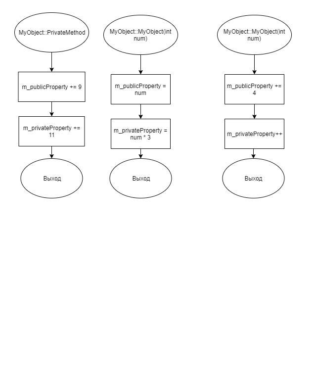

# Задание 2_1_2 - Доступ к элементам объекта

## 1 ПОСТАНОВКА ЗАДАЧИ

Сконструировать систему, которая демонстрирует возможность определения
режима доступа к элементам объекта.
Спроектировать объект, в котором есть доступные и скрытые элементы
(свойства и методы). Есть одно доступное свойство целого типа и одно скрытое
свойство целого типа.
У объекта есть доступные методы со следующим функционалом:
- метод с параметром целого типа, для определения исходного значения
элементов объекта. В методе доступному свойству присваивается значение
параметра, а скрытому свойству утроенное значение параметра;
- метод изменения значения доступного и cкрытого свойства. Доступному 
свойству добавляется 4, cкрытому свойству добавляется 1;
- метод вызова закрытого метода;
- метод вывода состояния, выводит значение доступного и cкрытого свойства.
У объекта есть один cкрытый метод со следующим функционалом:
- Метод доступному свойству добавляется 9, cкрытому свойству добавляется 11.

<br>

Написать программу, которая состоит из описания класса
вышепредставленного объекта и основной функции, в которой реализован
следующий алгоритм:
1. Ввод целочисленного значения переменной i_data.
2. Создание объекта.
3. Вызов метода  для определения исходного значения элементов объекта, в качестве аргумента передается переменная i_data.
4. Вывод исходного состояния объекта.
5. Вызов метода изменения значений свойств объекта.
 6. Вывод текущего состояния объекта.
 7. Ввод целочисленного значения переменной i_data.
 8. Если значение i_data больше, чем значение доступного свойства объекта,
 то 8.1. Присвоение доступному свойству объекта значение выражения
 i_data * 8 и переход к пункту 10.
 9. Иначе 
    9.1. Переход к пункту 10.
 10. Вывод текущего состояния объекта.
 11. Вызов метода объекта, который вызывает cкрытый метод объекта.
 12. Вывод текущего состояния объекта

### Входные данные
Первая строка<br>
`«Целочисленное значение»`<br>
Вторая строка<br>
`«Целочисленное значение»`

### Выходные данные
Метод вывода состояния, первый вывод делает в первой строке, а далее с новой. Шаблон вывода:
`Value of the available property «значение доступного свойства»; Value of a hidden property «значение закрытого свойства»`

## 2 МЕТОД РЕШЕНИЯ

Для решения задачи используется:
- объект obj класса MyObject предназначен для демонстрации работы   программы.

## 3 ОПИСАНИЕ АЛГОРИТМОВ

### Функция main
- Функционал: Входная точка программы.
- Параметры: нет.
- Возвращаемое значение: int.

| № | Предикат | Действия | № перехода |
| - | -------- | -------- | ---------- |
| 1 | | Объявление i_data | 2 |
| 2 | | Ввод i_data | 3 |
| 3 | | Создание объекта obj класса MyObject | 4 |
| 4 | | Вызов obj->Represent() | 5 |
| 5 | | Вызов obj->ChangeValues() | 6 |
| 6 | | Вызов obj->Represent() | 7 |
| 7 | | Ввод i_data | 8 |
| 8 |  i_data > obj->m_publicProperty | m_publicProperty = i_data * 8 | 9 |
| | | | 9 |
| 9 | | Вызов obj->Represent() | 10 |
| 10 | | Вызов obj->CallHidden() | 11 |
| 11 | | Вызов obj->Represent() | 0 |

## 4 БЛОК-СХЕМА




## 5 ИСХОДНЫЙ КОД

### main.cpp
```cpp
#include "MyObject.h"

int main()
{
    int i_data;
    std::cin >> i_data;

    MyObject* obj = new MyObject(i_data);
    obj->Represent();
    obj->ChangeValues();
    obj->Represent();

    std::cin >> i_data;

    if (i_data > obj->m_publicProperty)
    {
        obj->m_publicProperty = i_data * 8;
    }

    obj->Represent();
    obj->CallHidden();
    obj->Represent();

    delete obj;
}
```

### MyObject.cpp
```cpp
#include "MyObject.h"

MyObject::MyObject(int num)
{
    m_publicProperty = num;
    m_privateProperty = num * 3;
}

void MyObject::PrivateMethod()
{
    m_publicProperty += 9;
    m_privateProperty += 11;
}

void MyObject::ChangeValues()
{
    m_publicProperty += 4;
    m_privateProperty++;
}

void MyObject::CallHidden()
{
    this->PrivateMethod();
}

void MyObject::Represent()
{
    std::cout << "Value of the available property " << m_publicProperty <<
    "; Value of a hidden property " << m_privateProperty << std::endl;
}
```

### MyObj.h
```cpp
#ifndef __MYOBJECT__H
#define __MYOBJECT__H
#include <iostream>

class MyObject
{
    int m_privateProperty = 0;

    void PrivateMethod();
public:
    int m_publicProperty = 0;
    MyObject(int num);

    void ChangeValues();
    void CallHidden();
    void Represent();
};

#endif
```

## 6 ТЕСТИРОВАНИЕ
| Входные данные | Ожидаемые выходные данные | Фактические выходные данные |
| -------- | -------- | ---------- |
| 0<br>0 | Value of the available property 0; Value of a hidden property 0<br>Value of the available property 4; Value of a hidden property 1<br>Value of the available property 4; Value of a hidden property 1<br>Value of the available property 13; Value of a hidden property 12 | Value of the available property 0; Value of a hidden property 0<br>Value of the available property 4; Value of a hidden property 1<br>Value of the available property 4; Value of a hidden property 1<br>Value of the available property 13; Value of a hidden property 12 |
| 100<br>200 | Value of the available property 100; Value of a hidden property 300<br>Value of the available property 104; Value of a hidden property 301<br>Value of the available property 1600; Value of a hidden property 301<br>Value of the available property 1609; Value of a hidden property 312 | Value of the available property 100; Value of a hidden property 300<br>Value of the available property 104; Value of a hidden property 301<br>Value of the available property 1600; Value of a hidden property 301<br>Value of the available property 1609; Value of a hidden property 312 |
