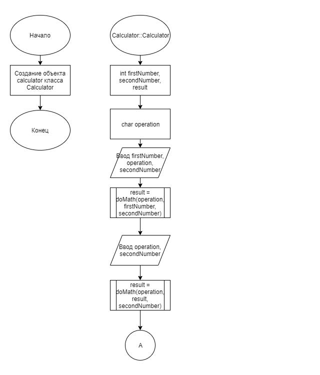
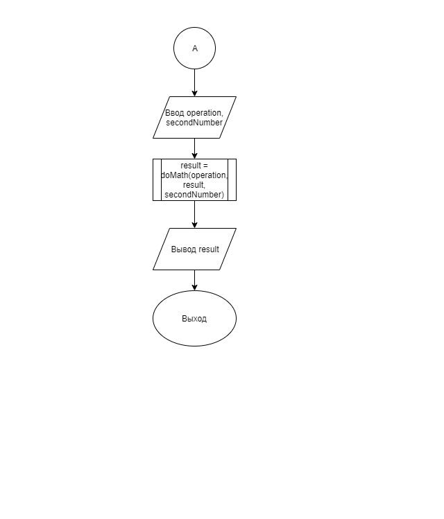
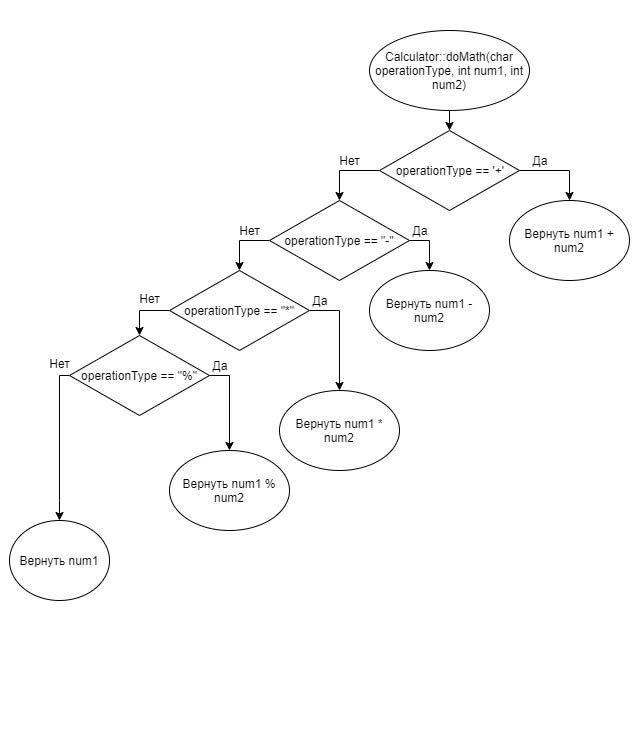

# Задание 2_1_1 - Доступ к элементам объекта

## 1 ПОСТАНОВКА ЗАДАЧИ

Сконструировать   систему,   которая   моделирует   работу   простогоарифметического калькулятора.

Спроектировать   объект,   который   вычисляет   значение   целочисленногоарифметического  выражения, состоящего  из трех последовательных операции. Операция деления заменена на операцию вычисления целочисленного остатка.

Объект обладает следующей функциональностью:
- выполняет первую операцию выражения, в качестве параметров передаетсяпервый   целочисленный   параметр,   символ   операции   (+,-,*,%),   второйцелочисленный параметр;
- вычисляет вторую и далее операцию, в качестве параметров передаетсясимвол операции (+,-,*,%), второй целочисленный параметр;
- возвращает значение вычисленного выражения (значение можно получитьпосле выполнения трех операции).

Алгоритм отработки системы:
1. Создает объект.
2. Вводит значения аргументов для первой операции.
3. Выполняет первую операцию.
4. Вводит значение аргументов для второй операции.
5. Выполняет вторую операцию.
6. Вводит значение аргументов для третьей операции.
7. Выполняет третью операцию.
8. Выводит результат.

### Входные данные
Первая строка:<br>
«целое число в десятичном формате»˽«символ операции»˽«целое число вдесятичном формате»<br>
Вторая строка:<br>
«символ операции»˽«целое число в десятичном формате»<br>
Третья строка:<br>
«символ операции»˽«целое число в десятичном формате»

### Выходные данные
Первая строка, с первой позиции:<br>
«значение выражения»

## 2 МЕТОД РЕШЕНИЯ

Для решения задачи используется:
- объект calculator класса Calculator предназначен для демонстрации работы программы;
- функция main для определения входной точки программы;
- библиотека ввода-вывода;
- класс;
- заголовочный файл.

Класс Calculator:
- функционал:
    - метод Calculator — создаёт объект;
    - метод doMath — выполняет математические операции.

## 3 ОПИСАНИЕ АЛГОРИТМОВ

### Функция main
- Функционал: Определение входной точки программы.
- Параметры: нет.
- Возвращаемое значение: int.

| № | Предикат | Действия | № перехода |
| - | -------- | -------- | ---------- |
| 1 | | Создание объекта calculator класса Calculator | 0 |

### Конструктор класса Calculator
- Функционал: Создаёт объект.
- Параметры: нет.

| № | Предикат | Действия | № перехода |
| - | -------- | -------- | ---------- |
| 1 | | Объявление int firstNumber, secondNumber, result | 2 |
| 2 | | Объявление char operation | 3 |
| 3 | | Ввод firstNumber, operation, secondNumber | 4 |
| 4 | | result = doMath(operation, firstNumber, secondNumber) | 5 |
| 5 | | Ввод operation, secondNumber | 6 |
| 6 | | result = doMath(operation, result, secondNumber) | 7 |
| 7 | | Ввод operation, secondNumber | 8 |
| 8 | | result = doMath(operation, result, secondNumber) | 9 |
| 9 | | Вывод result | 0 |

### Метод doMath класса Calculator
- Функционал: Выполняет математические операции.
- Параметры: char operationType, int num1, int num2.
- Возвращаемое значение: int.

| № | Предикат | Действия | № перехода |
| - | -------- | -------- | ---------- |
| 1 | operationType = '+' | Объявление int firstNumber, secondNumber, result | 0 |
|   | | | 2 |
| 2 | operationType = '-' | Вернуть num1 - num2 | 0 |
|   | | | 3 |
| 3 | operationType = '*' | Вернуть num1 * num2 | 0 |
|   | | | 4 |
| 4 | operationType = '%' | Вернуть num1 % num2 | 0 |
|   | | Вернуть num1 | 0 |

## 4 БЛОК-СХЕМА





## 5 ИСХОДНЫЙ КОД

### main.cpp
```cpp
#include "Calculator.h"

int main()
{
    Calculator calculator;
    return 0;
}
```

### MyObject.cpp
```cpp
#include "Calculator.h"
#include <iostream>

Calculator::Calculator()
{
    int firstNumber, secondNumber, result;
    char operation;
    std::cin >> firstNumber >> operation >> secondNumber;
    result = this->doMath(operation, firstNumber, secondNumber);
    std::cin >> operation >> secondNumber;
    result = this->doMath(operation, result, secondNumber);
    std::cin >> operation >> secondNumber;
    result = this->doMath(operation, result, secondNumber);
    std::cout << result;
}

int Calculator::doMath(char operationType, int num1, int num2)
{
    if (operationType == '+')
    {
        return num1 + num2;
    }
    else if (operationType == '-')
    {
        return num1 - num2;
    }
    else if (operationType == '*')
    {
        return num1 * num2;
    }
    else if (operationType == '%')
    {
        return num1 % num2;
    }
    else
    {
        return num1;
    }
}
```

### MyObject.h
```cpp
#ifndef __CALCULATOR__H
#define __CALCULATOR__H

class Calculator
{
    int doMath(char operationType, int num1, int num2);
public:
    Calculator();
};

#endif
```

## 6 ТЕСТИРОВАНИЕ
| Входные данные | Ожидаемые выходные данные | Фактические выходные данные |
| -------- | -------- | ---------- |
| 10 + 10<br>+ 5<br>* 3 | 75 | 75 |
| 5 - 5<br>* 3<br>% 2 | 0 | 0 |
| 15 % 4<br>* 2<br>+ 10 | 16 | 16 |