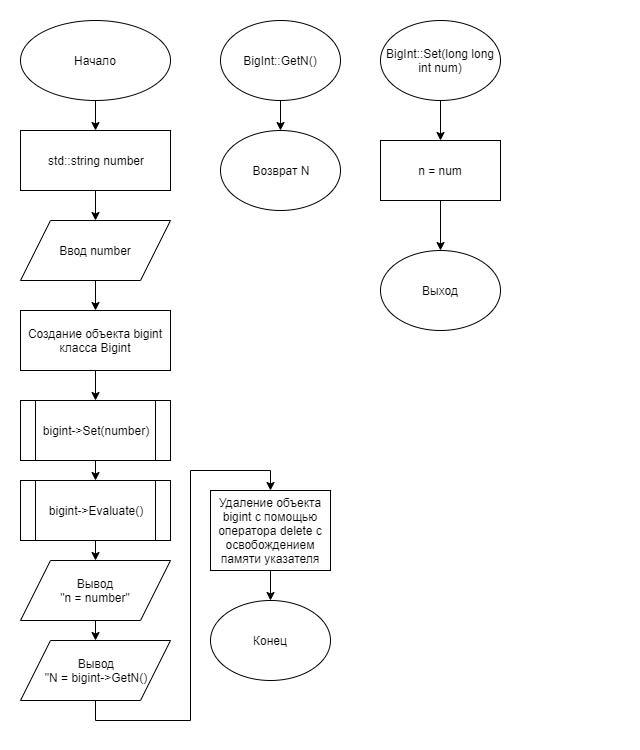
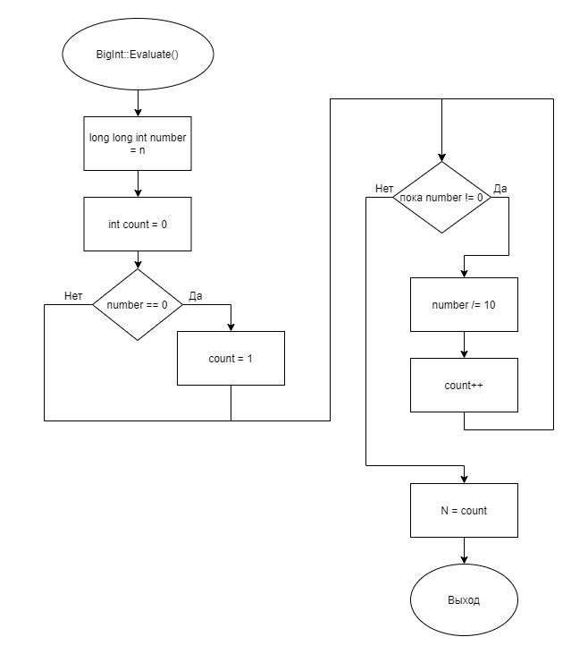

# Задание 2_1_4 - Переменная целого типа максимальной длины

## 1 ПОСТАНОВКА ЗАДАЧИ

Сконструировать систему, которая демонстрирует интервал значений
переменной целого типа максимальной длины.
Спроектировать объект, который обрабатывает переменную целого типа
максимальной длины.
У объекта есть закрытое свойство n целого типа максимальной длины.
Объект обладает следующей функциональностью:
- задает значение свойства n;
- вычисляет количество цифр значения свойства n;
- возвращает количество цифр значения свойства n.

Алгоритм отработки системы:
1. Создает объект.
2. Вводит значение переменной целого типа.
3. Определяет значение свойства n по значению переменной целого типа.
4. Вычисляет количество цифр свойства n.
5. Выводит значение свойства n.
6. Выводит количество цифр значения свойства n

### Входные данные
Первая строка:<br>
Целое число в десятичном формате.

### Выходные данные
Первая строка:<br>
n = «значение свойства n»<br>
Вторая строка:<br>
N = «количество цифр свойства n»

## 2 МЕТОД РЕШЕНИЯ

Для решения задачи используется:
- объект bigint класса BigInt предназначен для демонстрации работы
программы;
- функция main для для определения входной точки программы;
- заголовочный файл;
- класс;
- указатель.

Класс BigInt:
- свойства/поля:
    - поле содержит значение вводимого числа:
        - наименование — n;
        - тип — long long int;
        - модификатор доступа — private;
    - поле содержит количество цифр в числе:
        - наименование — N;
        - тип — int;
        - модификатор доступа — private;
- функционал:
    - метод Evaluate — вычисляет количество цифр у n;
    - метод GetN — получает значение приватного поля N;
    - метод Set — задаёт значение приватному полю n.

## 3 ОПИСАНИЕ АЛГОРИТМОВ

## Метод Evaluate класса BigInt
- Функционал: Вычисляет количество цифр у n.
- Параметры: нет.
- Возвращаемое значение: int.

| № | Предикат | Действия | № перехода |
| - | -------- | -------- | ---------- |
| 1 | | Инициализация переменной number типа long long
int значением n | 2 |
| 2 | | Инициализация переменной count типа int
значением 0 | 0 |
| 3 | number = 0 | count = 1 | 4 |
|  | | | 4 |
| 4 | number != 0 | number /= 10 | 5 |
| | | | 6 |
| 5 | | count++ | 4 |
| 6 | | N = count | 0 |

## Метод GetN класса BigInt
- Функционал: Получает значение приватного поля N.
- Параметры: нет.
- Возвращаемое значение: int.

| № | Предикат | Действия | № перехода |
| - | -------- | -------- | ---------- |
| 1 | | Возврат N | 0 |

## Метод Set класса BigInt
- Функционал: Задаёт значение приватному полю n.
- Параметры: long long int num.
- Возвращаемое значение: void.

| № | Предикат | Действия | № перехода |
| - | -------- | -------- | ---------- |
| 1 | | Инициализация поля n = num | 0 |

### Функция main
- Функционал: Определение входной точки программы.
- Параметры: нет.
- Возвращаемое значение: int.

| № | Предикат | Действия | № перехода |
| - | -------- | -------- | ---------- |
| 1 | | Объявление long long int number | 2 |
| 2 | | Ввод значения переменной number | 3 |
| 3 | | Создание объекта bigint класса BigInt | 4 |
| 4 | | Вызов bigint->Set(number) | 5 |
| 5 | | Вызов bigint->Evaluate() | 6 |
| 6 | | Вывод "n = number" | 7 |
| 7 | | Вывод "N = bigint->GetN()"  | 8 |
| 8 | | Удаление объекта bigint с помощью оператора delete с
освобождением памяти указателя | 0 |

## 4 БЛОК-СХЕМА




## 5 ИСХОДНЫЙ КОД

### main.cpp
```cpp
#include <iostream>
#include "BigInt.h"

int main()
{
    long long int number;
    std::cin >> number;

    BigInt* bigint = new BigInt();
    bigint->Set(number);
    bigint->Evaluate();

    std::cout << "n = " << number << std::endl;
    std::cout << "N = " << bigint->GetN() << std::endl;

    delete bigint;

    return 0;
}
```

### BigInt.cpp
```cpp
#include "BigInt.h"

void BigInt::Set(long long int num)
{
    n = num;
}

void BigInt::Evaluate()
{
    long long int number = n;
    int count = 0;
    if (number == 0) count = 1;
    while (number != 0)
    {
    number /= 10;
    count++;
    }
    N = count;
}

int BigInt::GetN()
{
    return N;
}
```

### BigInt.h
```cpp
#ifndef __BIGINT__H
#define __BIGINT__H

class BigInt
{
    long long int n = 0;
    int N = 0;
public:
    void Set(long long int num);
    void Evaluate();
    int GetN();
};

#endif
```

## 6 ТЕСТИРОВАНИЕ
| Входные данные | Ожидаемые выходные данные | Фактические выходные данные |
| -------- | -------- | ---------- |
| 123 | n = 123<br>N = 3 | n = 123<br>N = 3  |
| 12345 | n = 12345<br>N = 5 | n = 12345<br>N = 5 |
| 55555555 | n = 55555555<br>N = 8 | n = 55555555<br>N = 8 |
| -12345 | n = -12345<br>N = 5 | n = -12345<br>N = 5 |
| 0 | n = 0<br>N = 1 | n = 0<br>N = 1 |
