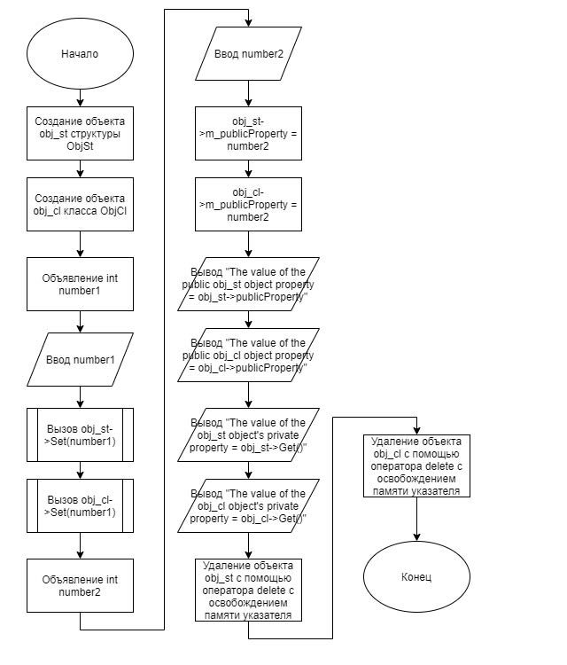
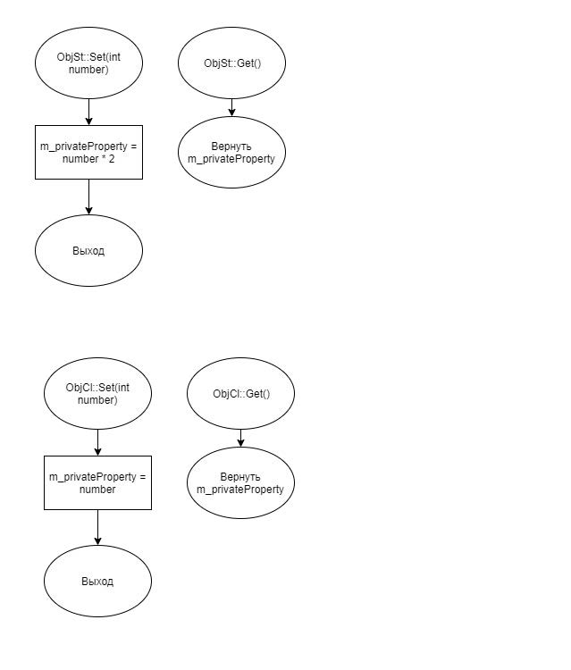

# Задание 2_2_1 - Особенности структуры

## 1 ПОСТАНОВКА ЗАДАЧИ

Сконструировать систему, которая демонстрирует отличие проектирования
объекта посредством структуры от проектирования посредством описания класса.
Спроектировать объект с одним целочисленным свойством открытого и
закрытого доступа. С функционалом открытого доступа для редактирования
значения свойства закрытого доступа и получения значения этого свойства.
Создать два описания этого объекта посредством структуры и класса. В
описании посредством структуры ключевое слово public не использовать. В
описании посредством класса ключевое слово private не использовать.
В описании структуры, в методе реализующей функционал редактирования
значения свойства закрытого доступа, исходное значение первоначально
удваивается.

Алгоритм отработки системы:
1. Создает объект с использованием описания структуры obj_st.
2. Создает объект с использованием описания класса obj_cl.
3. Вводит целочисленное значение и присваивает к закрытому свойству
объекта obj_st и obj_cl.
4. Вводит целочисленное значение и присваивает к открытому свойству
объекта obj_st и obj_cl.
5. Выводит значения открытых свойств объекта obj_st и obj_cl.
6. Выводит значения закрытых свойств объекта obj_st и obj_cl.

### Входные данные
Первая строка:<br>
`«Целое число»`<br>
Вторая строка:<br>
`«Целое число»`

### Выходные данные
The value of the public obj_st object property = «целое число»<br>
The value of the public obj_cl object property = «целое число»<br>
The value of the obj_st object's private property = «целое число»<br>
The value of the obj_cl object's private property = «целое число»

## 2 МЕТОД РЕШЕНИЯ

Для решения задачи используется:
- объект obj_st класса ObjSt предназначен для демонстрации работы
структуры;
- объект obj_cl класса ObjCl предназначен для демонстрации работы
класса;
- функция main для для определения входной точки программы;
- указатели;
- заголовочные файлы;
- класс;
- структура;
- стандартная библиотека ввода-вывода.

Класс ObjSt:
- свойства/поля:
    - поле хранит целочисленное число:
        - наименование — m_privateProperty;
        - тип — int;
        - модификатор доступа — private;
    - поле хранит целочисленное число:
        - наименование — publicProperty;
        - тип — int;
        - модификатор доступа — public;
- функционал:
    - метод Set — задаёт значение приватному полю m_privateProperty;
    - метод Get — получает значение приватного поля publicProperty.

Класс ObjCl:
- свойства/поля:
    - поле хранит целочисленное число:
        - наименование — m_privateProperty;
        - тип — int;
        - модификатор доступа — private;
    - поле хранит целочисленное число:
        - наименование — publicProperty;
        - тип — int;
        - модификатор доступа — public;
- функционал:
    - метод Set — задаёт значение приватному полю m_privateProperty;
    - метод Get — получает значение приватного поля publicProperty.

## 3 ОПИСАНИЕ АЛГОРИТМОВ

### Метод Set класса ObjSt
- Функционал: Задаёт значение приватному полю m_privateProperty.
- Параметры: int num.
- Возвращаемое значение: void.

| № | Предикат | Действия | № перехода |
| - | -------- | -------- | ---------- |
| 1 | | Инициализация приватного поля m_privateProperty = number | 0 |

### Метод Get класса ObjSt
- Функционал: Получает значение приватного поля propertyProperty.
- Параметры: нет.
- Возвращаемое значение: int.

| № | Предикат | Действия | № перехода |
| - | -------- | -------- | ---------- |
| 1 | | Возвращение приватного поля m_privateProperty | 0 |

### Метод Set класса ObjCl
- Функционал: Задаёт значение приватному полю m_privateProperty.
- Параметры: int num.
- Возвращаемое значение: void.

| № | Предикат | Действия | № перехода |
| - | -------- | -------- | ---------- |
| 1 | | Инициализация приватного поля m_privateProperty = number | 0 |

### Метод Get класса ObjCl
- Функционал: Получает значение приватного поля propertyProperty.
- Параметры: нет.
- Возвращаемое значение: int.

| № | Предикат | Действия | № перехода |
| - | -------- | -------- | ---------- |
| 1 | | Возвращение приватного поля m_privateProperty | 0 |

### Функция main
- Функционал: Определение входной точки программы.
- Параметры: нет.
- Возвращаемое значение: int.

| № | Предикат | Действия | № перехода |
| - | -------- | -------- | ---------- |
| 1 | | Создание объекта obj_st класса ObjSt | 2 |
| 2 | | Создание объекта obj_cl класса ObjCl | 3 |
| 3 | | Объявление целочисленной переменной number1 | 3 |
| 4 | | Ввод number1 | 3 |
| 5 | | Вызов obj_st->Set(number1) | 3 |
| 6 | | Вызов obj_cl->Set(number1) | 3 |
| 7 | | Объявление целочисленной переменной number2 | 3 |
| 8 | | Ввод number2 | 3 |
| 9 | | Иницализация публичного поля obj_st->publicProperty = number | 3 |
| 10 | | Иницализация публичного поля obj_cl->publicProperty = number | 3 |
| 11 | | Вывод "The value of the public obj_st object property = obj_st->publicProperty" | 12 |
| 12 | | Вывод "The value of the public obj_cl object property = obj_st->publicProperty" | 13 |
| 13 | | Вывод "The value of the obj_st object's private property = obj_st->Get()" | 14 |
| 14 | | Вывод "The value of the obj_cl object's private property = obj_cl->Get()" | 15 |
| 15 | | Удаление   объекта   obj_st   с   помощью   оператора   delete   сосвобождением памяти указателя | 16 |
| 16 | | Удаление   объекта   obj_cl   с   помощью   оператора   delete   сосвобождением памяти указателя | 0 |

## 4 БЛОК-СХЕМА




## 5 ИСХОДНЫЙ КОД

### main.cpp
```cpp
#include "ObjSt.h"
#include "ObjCl.h"
#include <iostream>

int main()
{
    ObjSt* obj_st = new ObjSt();
    ObjCl* obj_cl = new ObjCl();

    int number1;
    std::cin >> number1;
    obj_st->Set(number1);
    obj_cl->Set(number1);

    int number2;
    std::cin >> number2;
    obj_st->publicProperty = number2;
    obj_cl->publicProperty = number2;

    std::cout << "The value of the public obj_st object property = " <<
    obj_st->publicProperty << std::endl;
    std::cout << "The value of the public obj_cl object property = " <<
    obj_cl->publicProperty << std::endl;

    std::cout << "The value of the obj_st object's private property = " <<
    obj_st->Get() << std::endl;
    std::cout << "The value of the obj_cl object's private property = " <<
    obj_cl->Get() << std::endl;

    delete obj_st;
    delete obj_cl;

    return 0;
}
```

### ObjCl.cpp
```cpp
#include "ObjCl.h"

void ObjCl::Set(int number)
{
    m_privateProperty = number;
}

int ObjCl::Get()
{
    return m_privateProperty;
}
```

### ObjCl.h
```cpp
#ifndef __OBJCL__H
#define __OBJCL__H

class ObjCl {
    int m_privateProperty;
public:
    int publicProperty;
    void Set(int number);
    int Get();
};

#endif
```

### ObjSt.cpp
```cpp
#include "ObjSt.h"

void ObjSt::Set(int number)
{
    m_privateProperty = number * 2;
}

int ObjSt::Get()
{
    return m_privateProperty;
}
```

### ObjSt.h
```cpp
#ifndef __OBJST__H
#define __OBJST__H

struct ObjSt {
    int publicProperty;
    void Set(int number);
    int Get();
private:
    int m_privateProperty;
};

#endif
```

## 6 ТЕСТИРОВАНИЕ
| Входные данные | Ожидаемые выходные данные | Фактические выходные данные |
| -------- | -------- | ---------- |
| 1<br>1 | The value of the public obj_st object property = 1<br>The value of the public obj_cl object property = 1<br>The value of the obj_st object's private property = 2<br>The value of the obj_cl object's private property = 1 | The value of the public obj_st object property = 1<br>The value of the public obj_cl object property = 1<br>The value of the obj_st object's private property = 2<br>The value of the obj_cl object's private property = 1 |
| 5<br>5 | The value of the public obj_st object property = 5<br>The value of the public obj_cl object property = 5<br>The value of the obj_st object's private property = 10<br>The value of the obj_cl object's private property = 5 | The value of the public obj_st object property = 5<br>The value of the public obj_cl object property = 5<br>The value of the obj_st object's private property = 10<br>The value of the obj_cl object's private property = 5 |
